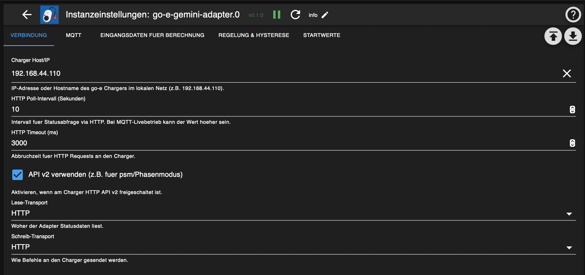

# ioBroker.go-e-gemini-adapter

Custom ioBroker Adapter fuer go-e Gemini Charger mit deterministischer Lade-Logik, klaren Datenpunkten und robustem HTTP/MQTT Betrieb.


## Was der Adapter kann

- Drei Betriebsmodi:
  - `1 = PV only`
  - `2 = PV only (go-e = priority)`
  - `3 = grid mode`
- Direkte Laufzeit-Steuerung ueber ioBroker States (`control.*`)
- Sofortiger Not-Stopp (`control.emergencyStop`) mit Prioritaet vor allen anderen Freigaben
- Start-/Stop-Verzoegerung gegen Flattern (`startDelaySec`, `stopDelaySec`)
- Dynamische Phasenwahl mit Hysterese + Mindesthaltezeit
- Optionales SoC-Limit fuer das Fahrzeug (`targetSocEnabled`, `targetSocPercent`)
- Eingangsdaten-Freshness-Pruefung mit Blockierung bei veralteten/missing Werten
- Simulation/Dry-Run Modus ohne reale Schreibbefehle
- HTTP und MQTT als Lese-/Schreibtransport (auch Hybrid beim Lesen)
- Diagnostik- und Entscheidungs-States fuer transparentes Debugging

## Architektur (vereinfacht)

```text
Externe Zaehler/PV/Batterie States
          |
          v
   inputs.* + Freshness Check
          |
          v
      Entscheidungslogik
  (Modus, Limits, Delays, Safety)
          |
          v
  control -> effectiveAllow/current/phase
          |
          v
      go-e Befehle (HTTP/MQTT)
          |
          v
 status.* / diagnostics.* Rueckmeldung
```

## Betriebsmodi und Logik

### Modus 1: `PV only` (`control.mode = 1`)

Berechnung:

`availablePowerW = pvPowerW - (houseConsumptionW - chargerPowerW) - reservePowerW`

Zusatzbedingungen:

- Hausakku muss als "voll" gelten:
  `homeBatterySocPercent >= batteryFullSocPercent`
- Netzbezug und Akku-Entladung muessen innerhalb des Puffers liegen:
  - `gridImportW <= pvOnlyFlowBufferW`
  - `homeBatteryDischargeW <= pvOnlyFlowBufferW`
- Bei aktivem `maxGridImportW` wird Ueberschreitung direkt von `availablePowerW` abgezogen.

### Modus 2: `PV only (go-e = priority)` (`control.mode = 2`)

Berechnung:

`availablePowerW = pvPowerW - (houseConsumptionW - chargerPowerW) - reservePowerW`

Zusatzbedingungen:

- Kein Akku-Voll-Kriterium
- Netzbezug und Akku-Entladung muessen innerhalb des Puffers liegen
- Optionaler `maxGridImportW` wird ebenfalls eingerechnet

### Modus 3: `grid mode` (`control.mode = 3`)

- Keine PV-Leistungsformel
- Verwendet direkte Sollwerte:
  - `control.gridManual.currentA`
  - `control.gridManual.phaseMode`

## Freigabe-Logik (`allowCharging` vs. `emergencyStop`)

- `control.allowCharging` ist der globale Master-Switch.
- `control.emergencyStop` hat immer Prioritaet und stoppt sofort (ohne Start/Stop-Delay).
- Effektive Freigabe:

`effectiveAllow = emergencyStop ? false : delayed(rawAllow)`

Dabei enthaelt `rawAllow` alle fachlichen Bedingungen (Modus, Leistung, SoC, Freshness, Buffer, usw.).

## Transport und Schnittstellen

### HTTP

- Status lesen:
  - `/status` (v1)
  - optional `/api/status` mit Filter (v2)
- Befehle schreiben:
  - v1: `/mqtt?payload=key=value`
  - v2 Phasenmodus: `/api/set?psm=...`

### MQTT

- Status Topic: `<prefix>/<serial>/status`
- Command Topic: `<prefix>/<serial>/cmd/req`
- Standard Prefix: `go-eCharger`

## Konfiguration (Admin)

### Verbindung

- `chargerHost`: IP/Hostname des Chargers
- `pollIntervalSec`: Poll-Intervall (auch bei Hybrid relevant)
- `httpTimeoutMs`: Timeout fuer HTTP Requests
- `readTransport`: `http | mqtt | hybrid`
- `writeTransport`: `http | mqtt`
- `enableApiV2`: noetig fuer v2-Features (z.B. `psm`)

### MQTT

- `mqttBrokerUrl`, `mqttUsername`, `mqttPassword`
- `mqttTopicPrefix`, `mqttSerial`

### Eingangsdaten

Konzept: positive-only Modell, getrennte Werte fuer Import/Export und Charge/Discharge.

- `gridImportObjectId`
- `gridExportObjectId`
- `pvPowerObjectId`
- `houseConsumptionObjectId`
- `homeBatteryDischargeObjectId`
- `homeBatteryChargeObjectId`
- `homeBatterySocObjectId`
- `carSocObjectId`

Hinweis:

- Die Regelung verwendet aktiv vor allem `pvPower`, `houseConsumption`, `gridImport`, `homeBatteryDischarge`, `homeBatterySoc` (Modus-abhaengig).
- `gridExport` und `homeBatteryCharge` werden eingelesen und als Inputs gespiegelt, sind aber aktuell nicht Kernbestandteil der Freigabeformel.

### Regelung & Stabilitaet

- `reservePowerW`
- `phaseSwitchUpThresholdW`
- `phaseSwitchHysteresisW`
- `phaseSwitchMinHoldSec`
- `startDelaySec`, `stopDelaySec`
- `maxInputAgeSec`
- `maxGridImportW` (`-1` deaktiviert)
- `pvOnlyFlowBufferW`
- `batteryFullSocPercent`
- `minCurrentA`, `maxCurrentA`
- `commandMinIntervalMs`

### Startwerte

- `defaultMode`
- `defaultGridCurrentA`
- `defaultGridPhaseMode`
- `defaultTargetSocEnabled`
- `defaultTargetSocPercent`
- `defaultSimulationMode`

## Wichtige Datenpunkte

### Steuerung (`control.*`)

- `control.allowCharging`
- `control.emergencyStop`
- `control.simulationMode`
- `control.mode`
- `control.gridManual.currentA`
- `control.gridManual.phaseMode`
- `control.minCurrentA`
- `control.maxCurrentA`
- `control.targetSocEnabled`
- `control.targetSocPercent`

### Status (`status.*`)

- `status.connection`
- `status.activeMode`
- `status.effectiveAllowCharging`
- `status.targetPhaseMode`, `status.actualPhaseMode`
- `status.chargerPowerW`, `status.chargerCurrentA`
- `status.setCurrentA`, `status.setCurrentVolatileA`
- `status.lastCommand`, `status.lastCommandAt`
- `status.sessionActive`, `status.sessionEnergyWh`, `status.sessionEnergyKWh`
- `status.decision` (wichtigster Debug-State)

### Diagnostik (`diagnostics.*`)

- `diagnostics.lastError`
- `diagnostics.inputsStale`
- `diagnostics.staleInputList`
- `diagnostics.oldestInputAgeSec`
- `diagnostics.httpReadFailStreak`
- `diagnostics.readSource`

## Wie Entscheidungen nachvollziehen?

1. `status.decision` lesen (enthaelt Trigger + Blockgruende)
2. `diagnostics.inputsStale` und `diagnostics.staleInputList` pruefen
3. `status.effectiveAllowCharging` mit `control.allowCharging` und `control.emergencyStop` abgleichen
4. `status.lastCommand` / `status.lastCommandAt` auf gesendete Befehle pruefen

## Screenshots

### Instanz-Settings (ioBroker Admin)



Optionaler Doku-Ordner fuer weitere Screenshots:

- `docs/screenshots/README.md`

## Troubleshooting (kurz)

- Laedt nicht trotz PV:
  - `status.decision` auf Buffer-, SoC- oder Freshness-Blocker pruefen.
- Keine Befehle am Charger:
  - `status.transportWrite` pruefen, MQTT Verbindung oder HTTP Erreichbarkeit testen.
- Werte "springen":
  - `startDelaySec`, `stopDelaySec`, `phaseSwitchMinHoldSec` erhoehen.
- Unerwarteter Netzbezug:
  - `reservePowerW` erhoehen, `maxGridImportW` aktivieren/justieren.

## Lizenz

MIT
